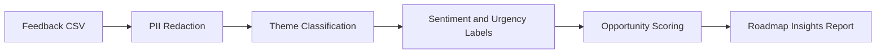

# UserLens AI

Near-real-time feedback intelligence for faster product decisions.

UserLens AI helps product managers turn scattered user feedback into product themes, user needs, hypotheses, and roadmap-ready prioritization signals before waiting weeks for a formal research synthesis cycle.

## Why I Built This

Product teams make design and roadmap decisions while feedback is still scattered across interviews, support tickets, surveys, sales notes, and internal docs. Formal research is valuable, but it can take 3-4 weeks to recruit, conduct, synthesize, and socialize findings.

UserLens AI is built around a practical PM workflow:

1. Bring messy feedback into one place.
2. Redact obvious PII.
3. Detect repeated product themes and urgency.
4. Convert those patterns into hypotheses to validate.
5. Use evidence-backed opportunity scores to inform roadmap tradeoffs.

The goal is not to replace user research. The goal is to help product teams learn faster and decide what deserves deeper validation.

## What The MVP Does

- Loads feedback from a CSV file
- Redacts emails, phone numbers, IP addresses, and user/account IDs
- Classifies feedback into product themes
- Labels sentiment and urgency
- Scores product opportunities by frequency, severity, and urgency
- Generates a Markdown report with evidence snippets and hypotheses
- Runs locally without requiring an LLM API key

## Demo Use Case

A PM has 12 pieces of feedback from interviews, support tickets, sales calls, and in-app surveys. UserLens AI identifies the strongest product opportunity, explains which user segment is most affected, and produces a report the PM can use in roadmap or design discussions.


Example output:

| Theme | Signal | Product Decision |
|---|---|---|
| Admin and permissions | High urgency, repeated admin confusion | Improve role explanations and permission previews |
| Onboarding friction | First-time evaluators unsure what to do first | Add guided setup and safer invite previews |
| Workflow efficiency | Power users repeating manual work | Explore bulk actions and workspace templates |

## Quickstart

```bash
pip install -r requirements.txt
streamlit run app.py
```

Then open the local Streamlit URL and keep "Use sample feedback" enabled.

## CSV Format

UserLens expects a CSV with these columns:

```csv
source,user_type,date,feedback
Interview,First-time evaluator,2026-07-01,"Onboarding was confusing..."
Support ticket,Admin user,2026-07-02,"The permissions screen is unclear..."
```

See [examples/sample_feedback.csv](examples/sample_feedback.csv).

## Product Thinking

This project demonstrates AI product management skills across:

- Problem framing and MVP scoping
- User research synthesis
- Privacy-aware AI workflow design
- Prioritization and roadmap tradeoffs
- Evaluation-first product development
- Clear communication for product, design, and engineering audiences

## Architecture



Read more in [docs/architecture.md](docs/architecture.md).

## Repository Guide

- [docs/PRD.md](docs/PRD.md): Product requirements and portfolio narrative
- [docs/product_decisions.md](docs/product_decisions.md): MVP tradeoffs and AI roadmap
- [docs/demo_results.md](docs/demo_results.md): What the sample demo proves
- [examples/sample_output_report.md](examples/sample_output_report.md): Example generated report
- [tests](tests): Basic PII and analysis tests

## Roadmap

- Add LLM-assisted synthesis for richer evidence-backed summaries
- Add confidence labels for each insight
- Add integrations with Slack, Zendesk, Intercom, Dovetail, Productboard, and Linear
- Add a hypothesis backlog view
- Add before/after tracking to measure whether shipped changes reduce repeated feedback themes

## Interview Narrative

"I built UserLens AI because PMs often wait weeks for formal research synthesis while roadmap and design decisions are already moving. The MVP ingests user feedback, redacts PII, detects product themes, labels urgency and sentiment, and turns patterns into prioritized hypotheses. I scoped the first version to be local-first and testable in under five minutes, then documented the roadmap for LLM-powered synthesis and workflow integrations."
