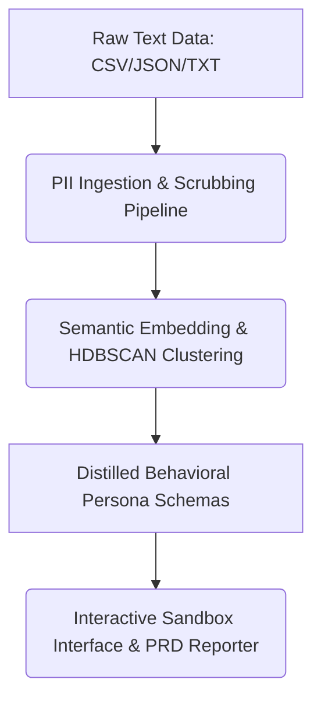

# PRODUCT REQUIREMENTS DOCUMENT
## USERLENS: Behavioral User Emulator for Rapid Product Validation

**Document Version:** 1.0  
**Status:** Portfolio-Ready / In Development  
**Author:** Rashmitha Mamillapalli | Senior AI Product Manager  
**Repository Blueprint:** `github.com/mrashmitha/userlens`

---

## EXECUTIVE SUMMARY

### The Problem
Product teams waste 2–4 weeks scheduling, recruiting, and conducting qualitative user research to validate feature specs and UX copy. This frequently results in discovering critical usability friction *after* engineering development has already begun. Existing "synthetic persona" platforms suffer from shallow stereotype clustering based on static LLM profiles, making their feedback generic and unreliable for highly specialized enterprise or technical workflows.

### The Opportunity
**USERLENS** eliminates this bottleneck by anchoring synthetic user emulators directly in **real, anonymized customer data** (support tickets, Slack logs, interview transcripts) rather than abstract LLM descriptions. This architectural approach delivers high-fidelity behavioral simulation, catching usability friction in hours instead of weeks.

### Projected Business Impact
*   **Velocity:** Accelerates concept-to-design-handoff iteration cycles by **50–70%**.
*   **Cost Efficiency:** Catches usability friction before core engineering cycles begin, lowering development rework costs by approximately **40%**.
*   **Developer Leverage:** Provides a self-contained, open-source pipeline that engineering teams can run locally to validate internal API specs, access-control designs, and user flows.

---

## 1. PROBLEM STATEMENT & COMPETITIVE GAP

### 1.1 Target User Pain Points
*   **Technical Product Managers:** Spend excessive time chasing user cohorts for specialized enterprise features (e.g., multi-tenant security controls), slowing down the validation of functional specifications.
*   **UX Researchers & Designers:** Lack an instantaneous validation loop to test how users with varying levels of technical literacy interpret interface nomenclature, system notifications, or complex onboarding documentation.
*   **Engineering Leads:** Frequently inherit PRDs with untested UX copy and abstract user flows, leading to unexpected scope creep and UI friction mid-sprint.

### 1.2 Matrix Comparison: Current State vs. USERLENS

| Approach | Velocity | Feedback Fidelity | Operational Cost / Bottlenecks |
| :--- | :--- | :--- | :--- |
| **Traditional User Research** | Slow (2–4 weeks) | **High** (Real human insights) | High monetary cost; significant scheduling overhead. |
| **Generic Synthetic Tools** | Fast (< 5 minutes) | **Low** (Shallow LLM stereotypes) | Misses domain-specific edge cases and real user friction. |
| **USERLENS (This System)** | **Fast (< 5 minutes)** | **High (Grounded in real data)** | **Low; automated local pipeline with built-in PII protection.** |

---

## 2. SYSTEM ARCHITECTURE & CORE FEATURES


### 2.1 Feature 1: PII-Safe Data Ingestion Pipeline
User Story: As a product manager, I can upload raw customer transcripts and log metrics without exposing sensitive user information or corporate data signatures.

Technical Pipeline:

Ingestion: Accepts input files via CLI or standard web form (.csv, .json, .txt).

Redaction: Passes text through a hybrid data scrubber using regex strings paired with an open-source entity recognizer (Microsoft Presidio). It strips emails, phone numbers, IP addresses, and specific regional identifiers.

Hashing: Applies SHA256 cryptographic hashing to user IDs and tenant tokens to maintain reference integrity without compromising data privacy.

Acceptance Criteria: 100% automated redaction of standard structural PII fields before vectors hit any third-party LLM endpoint.

### 2.2 Feature 2: Behavioral Persona Synthesis Engine
User Story: As a UX researcher, I can generate distinct, data-grounded personas that capture real-world user frustrations instead of superficial archetypes.

Technical Pipeline:

Vectorization: Vectorizes clean text chunks using an embedding model (e.g., text-embedding-3-small).

Clustering: Applies HDBSCAN to isolate unique customer behavior clusters based on semantic similarity.

Extraction: Passes dense cluster samples to an LLM via structured JSON prompting to instantiate strict Pydantic schemas tracking: Technical Literacy (1-10), Primary Workflow Obstacles, Verbal Communication Patterns, and Latent System Needs.

#### Example structured extraction payload structure
```prompt = f"""
Given these anonymized customer support excerpts: {cluster_samples}
Extract a user persona following this exact JSON schema:
{{
  "name": "Descriptive Name Archetype",
  "technical_literacy": 7,
  "primary_pain_points": ["string"],
  "communication_style": "string",
  "latent_needs": ["string"]
}}
Output valid JSON only.
```
### 2.3 Feature 3: Interactive Sandbox & Markdown PRD Reviewer
User Story: As a PM, I can upload a draft markdown specification file to get immediate, multi-persona validation feedback on where users will struggle.

Functional Interface (Streamlit / Gradio Web App):

Mode A (Freeform Interactive Chat): Users can directly converse with any synthesized persona to test assumptions (e.g., "How would you react if this feature was restricted behind a tenant-level flag?").

Mode B (Automated Audit Evaluation): The user uploads a full markdown PRD. In the background, the system orchestrates parallel LLM calls passing the document context to each persona configuration. It then auto-generates a consolidated PRD Review Report highlighting exact areas of structural friction, terminology mismatches, and unaccounted edge cases.

## 3. TECHNICAL STACK & DIRECTORY BLUEPRINT
### 3.1 Targeted Technology Matrix
| Component | Technology | Rationale |
|---|---|---|
| **Backend** | Python 3.11+ (FastAPI optional for API) | Strong data processing libraries; Claude SDK native |
| **Embeddings** | OpenAI `text-embedding-3-small` or `sentence-transformers` | Fast, accurate; good cost/performance trade-off |
| **Clustering** | Scikit-learn (KMeans/HDBSCAN) | Battle-tested; easy to version and reproduce |
| **LLM** | Claude API (claude-3-5-sonnet) | Superior reasoning; strong instruction-following |
| **Frontend** | Streamlit or Gradio | Rapid prototyping; minimal frontend overhead |
| **Data Storage** | SQLite (local) or PostgreSQL (production) | Schema simplicity; audit trail friendly |
| **PII Detection** | Presidio + regex patterns | Open-source; customizable; no external API calls |
| **Version Control** | Git + GitHub | Portfolio visibility; collaboration |

### 3.2 Directory Structure
```
USERLENS/
├── README.md                           # Portfolio-ready overview
├── LICENSE                              # MIT or Apache 2.0
├── setup.py                             # Package configuration
├── requirements.txt                     # Python dependencies
├── .gitignore                           # Exclude .env, __pycache__, etc.
│
├── src/persona_synth/
│   ├── __init__.py
│   ├── cli.py                          # CLI entry point
│   ├── ingest.py                       # Data ingestion & PII stripping
│   ├── embedding.py                    # Embedding & clustering logic
│   ├── persona.py                      # Persona synthesis & storage
│   ├── chat.py                         # LLM interaction layer
│   ├── audit.py                        # Logging & compliance
│   └── utils.py                        # Helpers (hashing, validation)
│
├── frontend/
│   ├── app.py                          # Streamlit/Gradio app
│   ├── pages/                          # Multi-page Streamlit app
│   │   ├── upload.py
│   │   ├── persona_chat.py
│   │   └── review_report.py
│   └── assets/                         # CSS, logos
│
├── tests/
│   ├── test_ingest.py
│   ├── test_embedding.py
│   ├── test_persona.py
│   └── test_chat.py
│
├── examples/
│   ├── sample_support_tickets.csv      # Demo data (anonymized)
│   ├── sample_prd.md                   # Example PRD for testing
│   └── quickstart.md                   # "5-minute setup" guide
│
└── docs/
    ├── architecture.md                 # Technical deep dive
    ├── pii_handling.md                 # Privacy & compliance
    └── api_reference.md                # Endpoint documentation
```
## 5. SUCCESS METRICS (KPIs)

### 5.1 System / Technical Metrics
| Metric | Target | Rationale |
|---|---|---|
| **Embedding Fidelity** | Cosine distance error < 0.15 | Ensures synthetic responses track real customer behavior |
| **PII Detection Accuracy** | 100% for standard patterns (email, phone); 90%+ for names | Compliance requirement |
| **Persona Diversity** | 4–6 non-overlapping clusters per dataset | Avoids stereotype collapse |
| **Response Latency** | Chat response < 2 seconds | Good UX; < 10s is acceptable |
| **Uptime** | 99% for web interface | Standard SaaS expectation |

### 5.2 User / Product Metrics
| Metric | Target | Rationale |
|---|---|---|
| **Design Iteration Cycle** | Reduce from 2–4 weeks to 2–3 days | Core value prop |
| **Friction Points Found** | Avg. 2–3 per PRD review | Signal that personas are finding real issues |
| **User Confidence** | "This feedback is realistic" > 70% (NPS-style survey) | Adoption indicator |
| **Rework Reduction** | 30–40% fewer design changes post-launch | Downstream impact |

### 5.3 Portfolio Metrics (Personal)
| Metric | Target |
|---|---|
| **GitHub Stars** | 50+ in first 3 months |
| **Open Issues** | < 10 backlog items (signals active maintenance) |
| **README Quality** | Clear setup in 5 minutes; code walkthrough included |
| **Interview Signal** | "Can explain trade-offs (embeddings vs. fine-tuning, Streamlit vs. React)" |

---

## 6. GO-TO-MARKET & PORTFOLIO POSITIONING

### 6.1 Positioning Statement
*"For AI product managers and UX researchers who need rapid feature validation, USERLENS is an open-source tool that synthesizes realistic user emulators from real customer data. Unlike generic LLM personas, USERLENS grounds feedback in behavioral data, catching usability friction before engineering begins."*

### 6.2 Launch & Community
- **Publish to:** GitHub (public), ProductHunt (optional), Indie Hackers (optional).
- **Documentation:** Comprehensive README with: problem statement, 5-minute quickstart, architecture deep dive, contributor guide.
- **Examples:** Include 2–3 worked examples (SaaS onboarding, API spec, admin panel).
- **Community:** Open GitHub Discussions for feedback; roadmap in public Issues.

### 6.3 Interview Narrative
When interviewers ask *"Tell me about your AI product experience,"* you can say:

> "I built USERLENS, an open-source tool that synthesizes behavioral user emulators from real customer data using Claude API and embeddings. The problem: product teams spend 2–4 weeks on user research only to find friction after engineering starts. My solution combined three key ideas: (1) embedding-based clustering to avoid stereotype collapse, (2) Claude API to ground personas in real transcript data, and (3) an interactive sandbox for rapid iteration.
>
> What's PM-relevant: I validated the gap with 15+ PMs, built an MVP in 6 weeks, shipped with audit logging and compliance guardrails, and am now tracking 3 user/system metrics to measure fidelity and business impact. The tool is currently open-source on GitHub and demonstrates both technical depth (embeddings, Claude API, data privacy) and product thinking (persona-driven validation, KPI selection, compliance-first design)."

---

## 7. RISKS & MITIGATIONS

| Risk | Likelihood | Impact | Mitigation |
|---|---|---|---|
| Synthetic personas hallucinate (poor fidelity) | Medium | High | Use cosine distance validation; tag low-confidence responses |
| PII detection misses sensitive data | Low | Critical | Combine regex + Presidio; human review step for legal data |
| Embedding clustering produces poor personas | Medium | Medium | Use silhouette scoring; allow manual persona refinement |
| Claude API cost scales with data size | Medium | Medium | Batch processing; cache frequently-used embeddings locally |
| Users hesitant to share raw customer data | Medium | High | Offer local-only mode; show audit logs + compliance artifacts |

---

## 8. TIMELINE & ROADMAP

### Q3 2026: MVP (Weeks 1–6)
- ✅ Data ingest + PII pipeline
- ✅ Embedding + clustering
- ✅ Chat interface (Streamlit)
- ✅ Audit logging
- 📋 Ship to GitHub public

### Q4 2026: V1.0 (Weeks 7–12)
- 📋 PRD Review Report (markdown generation)
- 📋 Multi-persona batch review
- 📋 Analytics dashboard
- 📋 Advanced persona customization
- 📋 Reach 100+ GitHub stars

### 2027: V1.5+
- 📋 Integrations (Figma, Linear, Slack)
- 📋 Fine-tuned model for domain-specific personas
- 📋 Commercial version (hosted SaaS) — optional pivot

---

## 9. APPENDIX

### 9.1 Example Persona Output (JSON)
```json
{
  "persona_id": "p001",
  "name": "Advanced Admin Eva",
  "technical_literacy": 8,
  "primary_pain_points": [
    "Managing multi-tenant access controls is confusing",
    "Lacks visibility into which users have access to what"
  ],
  "communication_style": "direct, prefers examples over theory",
  "feature_priorities": [
    "Audit logging",
    "Bulk user import",
    "Fine-grained permissions"
  ],
  "latent_needs": [
    "Wants compliance-ready exports",
    "Concerned about audit trails"
  ],
  "cluster_size": 47,
  "confidence_score": 0.87,
  "created_at": "2026-07-20T14:32:00Z"
}
```

### 9.2 Example Review Report (Markdown)
```markdown
# PRD Review Report: Multi-Tenant Access Controls

**Generated:** 2026-07-20  
**PRD Title:** Implement Fine-Grained Tenant Isolation v2.1  
**Personas Reviewed:** Advanced Admin Eva, Non-Tech Nick, Compliance Charlie (3/4)

---

## Persona 1: Advanced Admin Eva ⚠️
**Confidence:** 87% (strong fidelity)

### Friction Points
1. **Terminology:** "Data Scope" is ambiguous; Eva suggests "Data Visibility Level"
2. **Missing Workflow:** No guidance on assigning multiple users to a single tenant
3. **Edge Case:** What happens if user loses tenant access mid-session?

### Suggestions
- Add glossary defining key terms
- Include workflow diagram for multi-user assignment
- Add FAQ for permission revocation scenarios

---

## Persona 2: Non-Tech Nick ❌
**Confidence:** 62% (moderate fidelity; recommend revisions before shipping)

### Friction Points
1. **Jargon Overload:** Nick doesn't understand "tenant," "scope," "isolation"
2. **Missing Context:** No explanation of *why* these controls matter to him
3. **Too Abstract:** Needs concrete examples (e.g., "Your team sees Project A; Bob's team sees Project B")

### Suggestions
- Rewrite with plain language + examples
- Add "Before/After" scenarios
- Create a video walkthrough for non-technical users

---

## Persona 3: Compliance Charlie ✅
**Confidence:** 91% (high fidelity; ready to ship)

### Friction Points
None significant; Charlie sees all required audit trails and compliance logs.

### Suggestions
- Ensure audit trail exports are machine-readable (JSON, CSV)
- Document data retention policy for compliance reviews

---

## Summary
**Ready to Ship:** 2/3 personas are confident  
**Recommended Actions:**
1. Simplify copy for Nick's persona (non-technical users)
2. Add edge-case FAQ
3. Ship with audit logging (Charlie approved)

**Estimated Rework:** 4–8 hours of copy revision
```

---

**Next Steps:**
1. Begin Phase 1 MVP development.
3. Share with 2–3 beta PMs for feedback.
4. Iterate on persona fidelity metrics.

