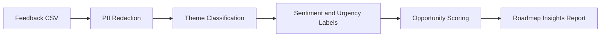

# Architecture

## Pipeline

1. Load feedback from a CSV file.
2. Redact common PII patterns such as emails, phone numbers, IP addresses, and user IDs.
3. Classify each feedback item into a product theme.
4. Label sentiment and urgency.
5. Group patterns into prioritized opportunities.
6. Generate a Markdown report with evidence snippets and hypotheses to validate.

## Scoring

Opportunity score is based on:

- Frequency of the theme
- Number of negative feedback items
- Number of high-urgency items

The score is capped at 100 so it is easy to compare across themes.

